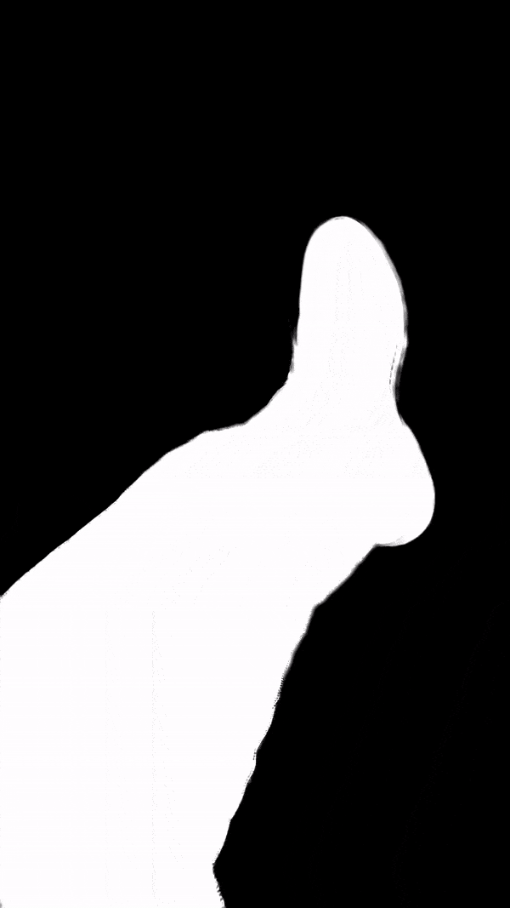
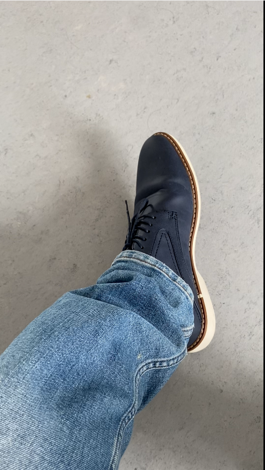
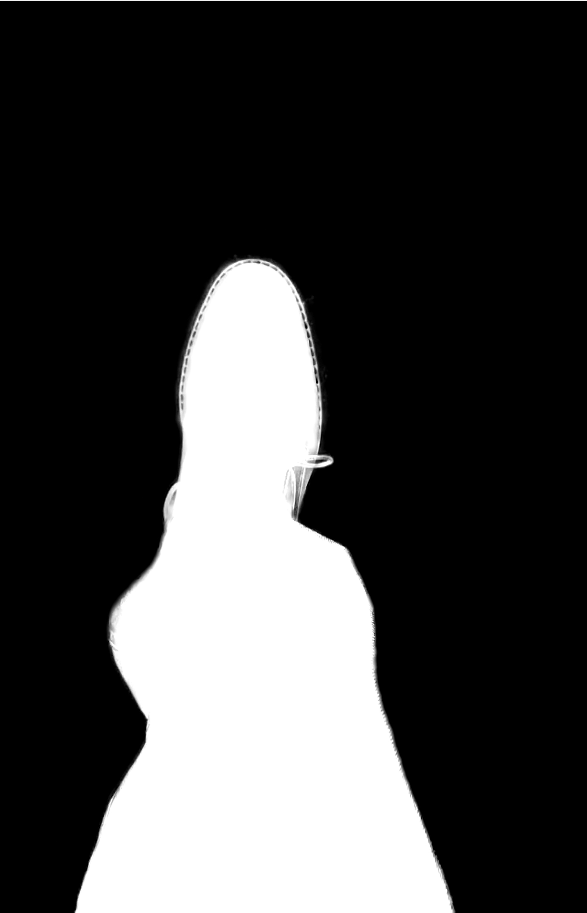
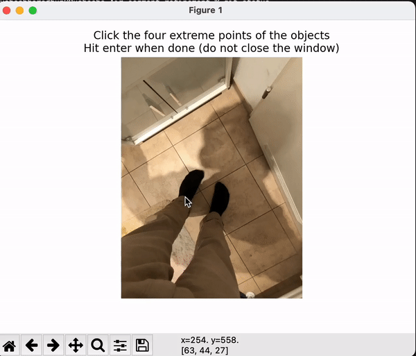

## DataAcquisition
   Any AI company knows the pain of data collection.
   In the name of Data Acquisition comes data capture,
   data annotation, data curation and data quality analysis.

   Usually the Data Capture is done in house and the rest is outsourced
   to Data Annotation companies who most likely with the help of human labour
   and tools like CVAT, etc.. perform classification, instance Segmentation
   whether polygonal or rectangular. (3D Data is harder though. Coming later though)

## Best Way to perform on Site Data Collection and Capture
   One of the most underrated or unused aspects of data collection is the temporal aspect of data
   which is so much ignore or overseen.

   For the application of Augmented Reality project (shoe overlay try in VR), one needed lots of
   try-on data to train neural networks for accurate positioning. Instead of relying
   from costly capture tools one can setup one easily with a phone while doing the product-try-on.

   Instantanous segmentation data collection. Harnessing the power of videos is infinite over
   discrete images which a lot of companies don't invest in or don't know. Tesla is a great example of one that does account for temporal correlation while acquiring data.

   * The First one is the input videos.
   * The second one being the segmentation mask.

   
   
   
   
   
   
   
   

   Here is the link to raw object capture video here:
   
   
   

   This app or automatic detection software was possible with a combination of
   Roust Video Matting and Optical Flow Estimation with Neural Networks.
   In 1 min of user-capture session, one can have automatic or semi-automatic
   segmentation data instantaneous at thousandth of the cost.

## Communication and Shareholders
   Usually when one chooses a Data Annotation company, that company should have Data Quality Analysis as well.

## Quality of Annotation or Segmentation or Tagged Data
   

   The usual procedure of AI Companies is to use CVAT or Oxford
   VIA Tool API to perform the segmentation or image or data classification
   or tagging. However as seen above the segmentation even with polygons is accurate enough.

   *  Depending on the application it can lead to severe problems. For instance if the
   task is only Object Detection. The polygon from the annotation company is really good.

   On the other hand if the task is to have perfect (close to perfect) segmentation to later
   render this image onto to a different scene or overlay, then its awful.

   * Per image the annotation had a cost of 2 USD. Instead my tool was a help to semi-automate the
   process (see below.) The tool would be given to the annotators and the output would be a perfect
   segmentation with 4-5 clicks of the extreme points.

   The advantage is 2 fold. First of all: time take to perform good segmentation is significantly
   reduced and the number of clicks can be a proxy for that.
   Secondly, quality of output with fewer clicks.

   The mistake of AI Companies is that they rely in the one size fits all approach. In this case like everyone relying on popular tools: CVAT,etc.. Since this particular use-case deals
   only with trousers, feet and shoes. Its well defined for a machine learning based segmentation model and grab cut. The idea behind was to propagate the segmentation using Grab Cut.

   The idea is inspired by artists and the Adobe Lasso-Tool (https://helpx.adobe.com/photoshop/using/content-aware-fill.html)

   ###whereartistmeetsengineering

  

  

  

  

Ref: https://github.com/nbei/Deep-Flow-Guided-Video-Inpainting more to come
