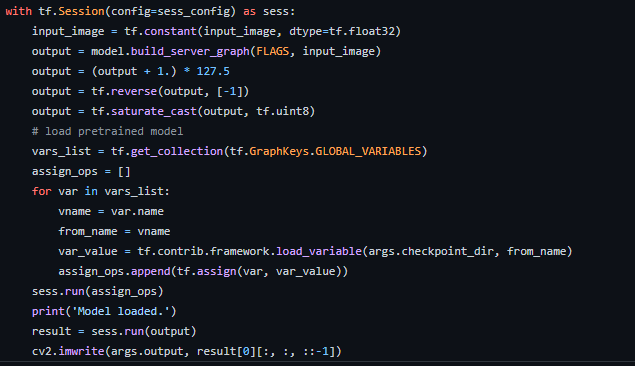
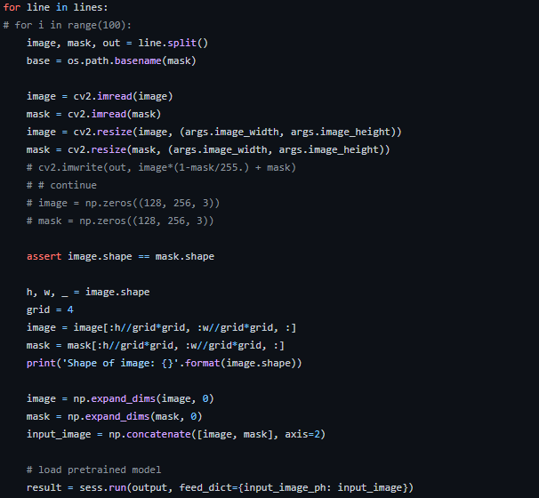
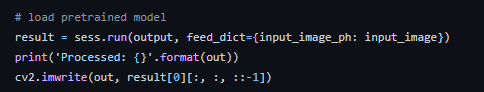

## Moving a PoC from Single Frame Inferencing to Inferencing in the Loop.

## Tensorflow:
     * 1. Most of the codes for PoC involve around one simple inference for a proof that the concept works.
     You might have just got the code from a git or did it yourself.

   The real question for the engineer is after the PoC works: how do you make it into a production close-to-be-ready version?

      Tips on Tensorflow:
      * 1. Usually the session is created
        2. Placeholder is defined and the image is
        fed as dict.

      * This is usually not a good practice and just looping over it over and over again.

As good Practice one needs to create a batch -placeholder.

    * 1. Create batch placeholder
      2. Load the graph and session once and then pass
         the batch images in a loop.

Example Below:
  For instance here the tf-graph is created for each loop or for each iteration the inference is being performed. This is quite inefficient since first
  you have time consumed between loading the graph and
  deleting it for each frame.
  * 

  When this code is to be rewritten for production
  the graph is build once and modified to accept
  a batch of image at the 'feed_dict'. The graph
  and placeholder are created beforehand
  * 
  * 

## Compare the runtime:
   here we perform the comparison
