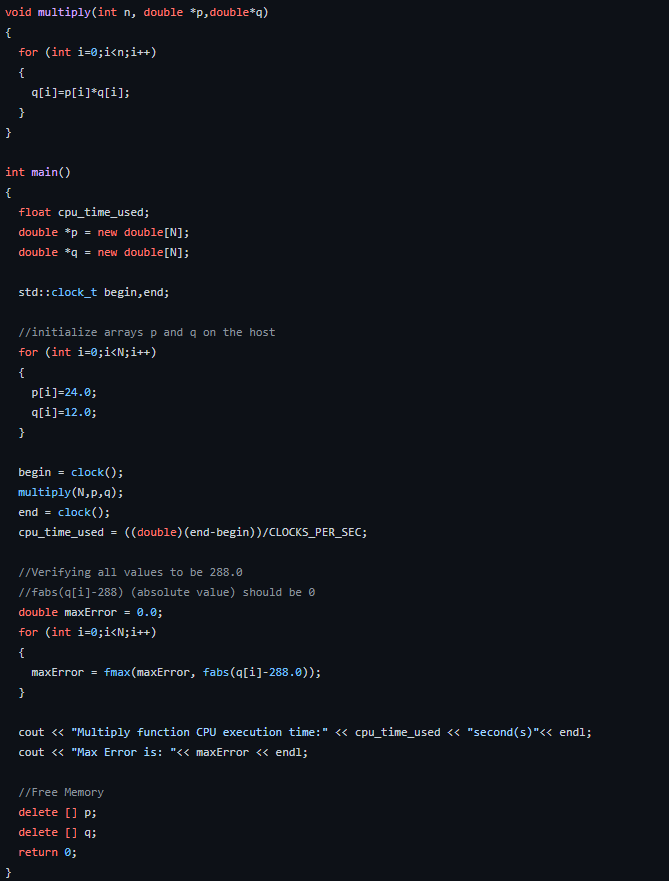
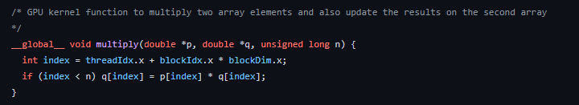
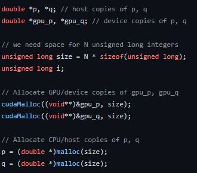
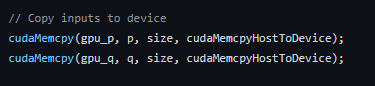
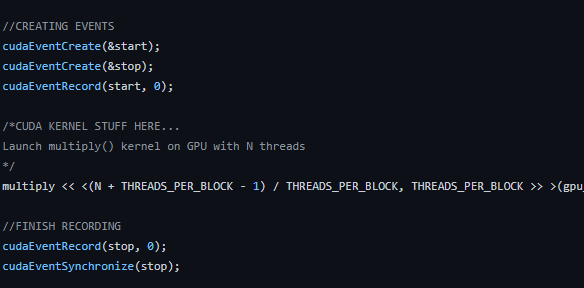
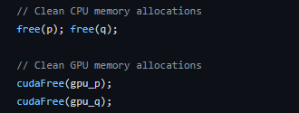
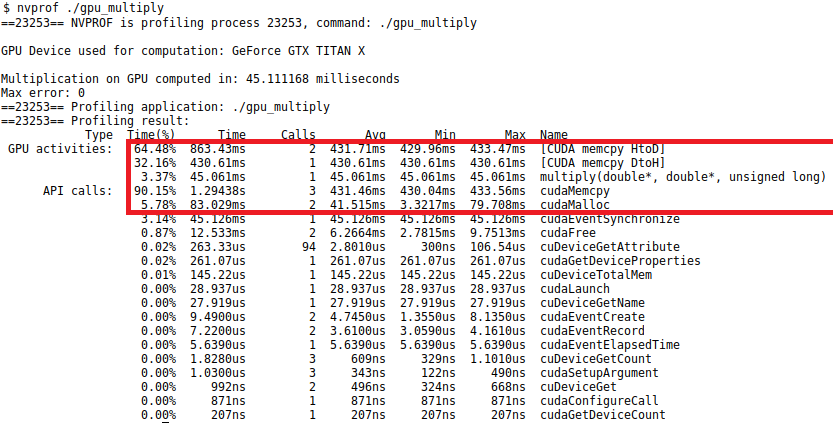
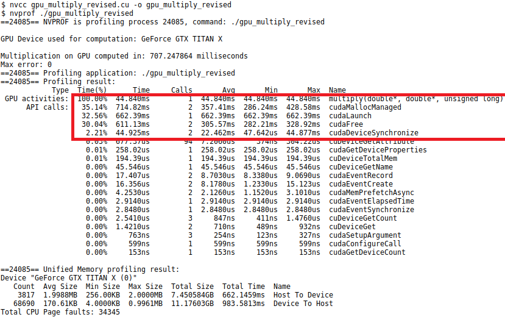

## Why?
   Cuda computations make use of the GPU. And we like things fast.
   CUDA Kernel is the native way of converting code from CPU to GPU.
   Things get infinitely fast.

## Below is a comparison of CPU code to be converted to GPU code:
     

   Steps needed to convert the code to native CUDA:

    1. Understand THREADS_PER_BLCOCK + BLOCKs

    So, the GPU has lots of small units called blocks and each block has a given number of threads.

    2. Converting functions to --> CUDA Kernels

  

      As shown above, the only
      thing to do is add __global__ kernel type to the function: change the index for the iteration, i.e. here matrix multiplication. For 2D and 1D matrix multiplication we need:
      to loop over the thread index as above.

    3. Declare and allocate the corresponding variables on the device (GPU)

  

    4. First of all, the variable is on the CPU and needs to be transferred to GPU.
  

    5. Initialize Cuda Events and call the CUDA modified function.
  

    6. If needed, we can opt to copy the result (called post-processing for Machine Learning Pipelines) back to the CPU. This is usually a bottleneck in
    the process of large data.
  

    7. Delete the variable when not in use.
  

## One Caveart though:
   The CPU-GPU conversion is the limiting factor though specially in Machine Learning world.
   There are several ways adapted to individual situation to solve the problem.
   Discussed in Detail under "Fast_inference_and_Video_Understanding".

   The CPU-GPU memory copy from device to host and back costs more time than the computation itself.
   Aggregated over all frames in a traditional machine learning inference pipeline.

    1. Load and Preprocess Frames CPU to output Pytorch or Tensorflow Tensors
    2. Perform Inference (GPU)
    3. In the case of video inference where for input(frame) and output is needed.
       Preprocessing involve fetching the Data from the GPU back to CPU for visualisation.

    1 and 3 are the biggest bottleneck. You can see it here in the example given with
    a simple matrix multiplication here.

  Below one can see: the Copying from Host/CPU to device/GPU takes 10 times more than the execution of the function itself.
  

  As an improvement we use the CuDaMallocManaged (unified memory which can be accessed by both CPU and GPU). This cuts the transfer from "863 + 430 ms" to "357 ms".

  
