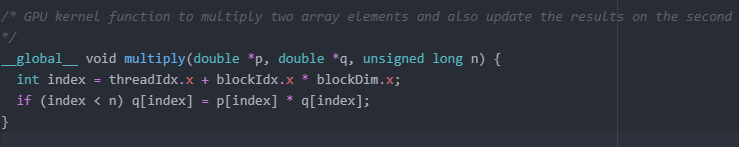
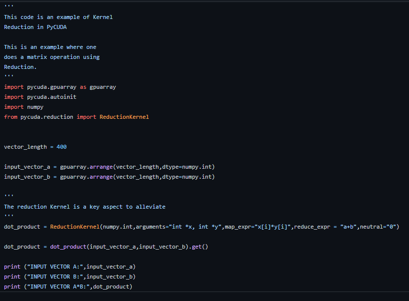

## What is reduction of CUDA?
   Reduction is an optimisation strategy that is an expansion
   of the global kernel.

   Previously, in the CUDA code we wrote we use
   the __global__ word (see below).
   

   In C++ code the __global__ is added to get the function to make
   it a CUDA Kernel.

   With reduction, we can use multiple thread blocks of the GPU
   and decompose a computation (kernel or function operation)
   into multiple kernel invocations.

## The dilemma: Comparing Pycuda to Cuda from a reduction perspective
    CUDA                             
        * C/C++ Based                      
        * Uses C/C++ combined with specialized code to accelerate computations    
        * Reduction is a key Feature       

    PyCUDA
        * Python Based
        * Python for GPUs to interface
        *  CUDA and accelerate computations
        * Reduction in pyCUDA is much simpler kudos to pycuda.reduction (https://github.com/inducer/pycuda/blob/main/pycuda/reduction.py) module
        *
  Its pretty clear that PyCUDA is the choice to go. I mean one has to know and Understand
  C++ but the one who wrote PyCUDA did a great job: otherwise its inevitable that one has to write it. Without PyCUDA we would have to reoptimise the __global__ kernel
  code depending on different GPU models with different number of threads and blocks.

## Example of Using Reduction in PyCUDA:
   The core aspect of Reduction in PyCUDA is the ReductionKernel:

   

   The reduction takes the following arguments
   * First Entry -->  data type of output
   * second entry --> data types of inputs
   * third entry --> map operation (here: product of the "i-th" element of the 2 vectors)
   * fourth entry --> reduction operation (here: sum of all products)

## References: Python Parallel Programming Cookbook: Giancarlo Zaccone
