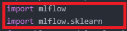
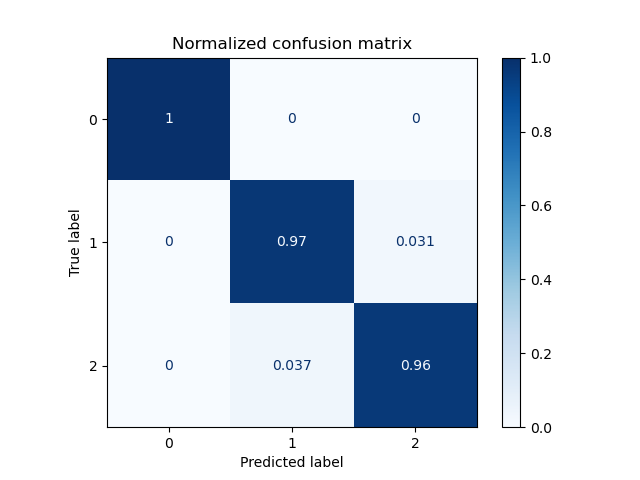

## Why ML Flow?
   Consider the scenario you are an R&D Deep Learning Engineer
   and performing lots of experiments to add new product
   feature or improve existing ones. You have new model from
   a new experiment setup to communicate during the 14 day
   sprint or stand-up and want to make that model
   tested or reproduced.

   1. Now you have to communicate about the dependencies and experiment setup to the other person. You could put it on
   git and make a .yml file or requirements.txt file. However
   when you need more and more libraries or different model
   type flavours: like pytorch or tensorflow this becomes a hassle. In the past: one had 2 choices build a massive separate testing environment for each or

   One could use onnx (model description .py file and .pb or .pth file) to get the intermediate representation then pass to the desired folder.

   2. Just use MLFlow. The new scenario becomes I pass the ML Flow model and MLFlow environment. More cool stuffs: you can
   also track the experiment using the Visualisation.

## What happens if I dont use it?

## The how of the story.
   #### 1. Visualisation TOOL
   
   

  Let's say you have a code for training independent of the flavours: Pytorch, Tensorflow,
  SKLEARN.

  You can simply follow the following steps to use the "ML Flow" flavour on top of your
  code:

  1. To start with: ML Flow is a good flow on top of Training Frameworks like Pytorch, Tensorflow, SKLEARN, etc...

  

  2. Next is to setup mlflow experiment with a name: "mlflow demo" for instance

  

  3. We are going to later use the name to call the MLFlow UI Api to display the results of the training task.

  4. We need to add the log to visualise the results afterwards using the local IP.
  

  5. The results of the visualisation and the task:
  

  #### 2. Reproducibility
       In the context of an AI-First Company and Machine Learning in General:
       Reproducibility is a key aspect which is why ML Flow "mlruns" comes into play.

  

  Logistic regression.py or any code "trainer.py" for instance will generate
  an "mlruns" directory.

    * A. This is where the magic occurs, as a Deep Learning R&D Engineer I can now give the folder to my colleagues or put it onto a working .git: and its easier to
    convey messages at standup.

    * The colleagues take "conda.yaml" --> create and environment and
    replicate the test to get the results I showed. Pretty terrific, right.

    * Another advantage is the "mlrun" already provides all the statistics:
    F1-score, log_loss, accuracy, ROC, confusion matrix.
    This saves an inhouse implementation and as such dev. costs and maintenance.

    Example of generated confusion matrix:
  
    * Another great feature of MLflow is the ability to re-run
    a specific experiment with the same parameters as it was run with originally. I mentionned before that you could pass the
    ML Run to your colleagues: well it turns out you can also git clone directly.

            Example:  mlflow run https://github.com/PacktPublishing/Machine-Learning-Engineering-with-MLflow/tree/master/Chapter01/stockpred

  #### 3. Exploring MLflow modules.
       --> MLflow Tracking: mechanism and UI to handle metrics and
       artifacts generated by ML executions.
       --> MLflow Projects: conda.yml, docker or local
       --> MLflow Models:
       --> MLflow Model Registry:

### MLFlow Pytorch Example of things:
    MLFlow Project as a wrapper supports a various
    number of projects/model flavors: mlflow model pytorch, tensorflow and pyfunc flavour.

    This allows one to easily save and restore a model where one wants to recheck a given experiment.

    Example:       
