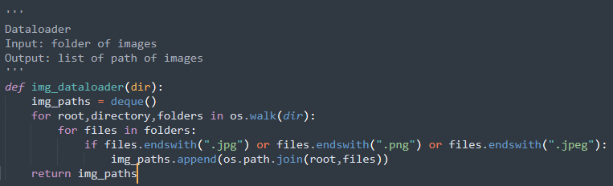
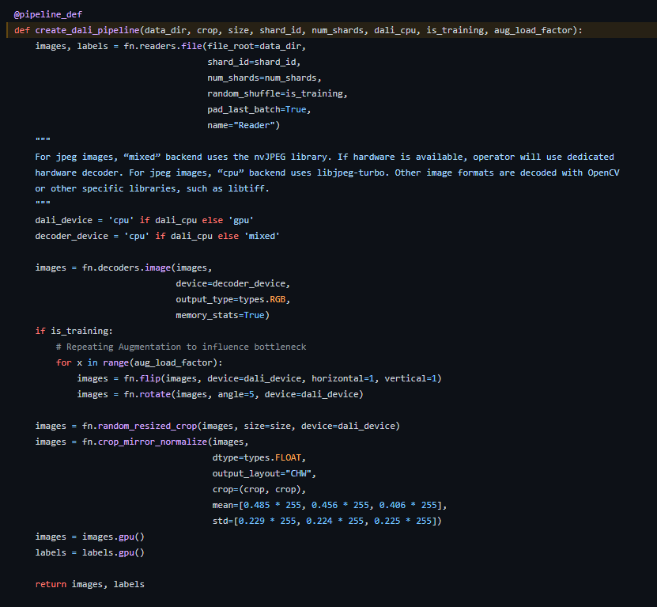
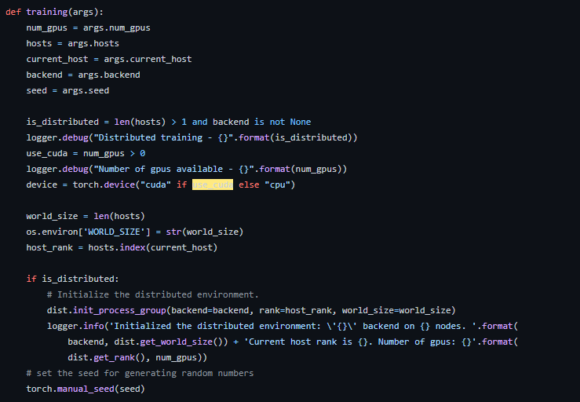
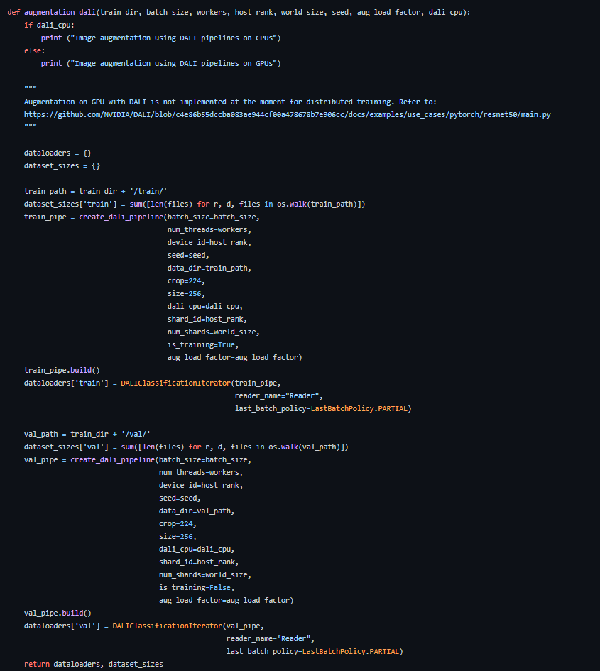
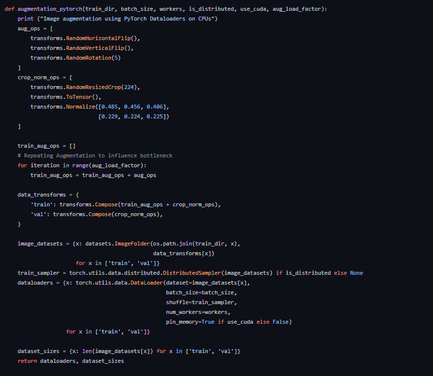

## The WHy?
    An AI first company  

## The What needed?

## How to do it?
    1. DATALOADER: Most data are structured and stored in specific folders for specific
   use-cases. From the inception itself to make the pipeline more efficient and
   modular: it makes sense to have a dataloader: location agnostic piece of code.

   

    2. preprocessor:
    The work of the preprocessor is to preprocess the data into a form digestible
    to the GPUs.

    * In the my day-to-day case:
    I use images or recently videos.
    Images and videos(series of images)
    These are natively consumed into arrays (numpy arrays or tensors whether pytorch or tensorflow).
    So for these 2 datatypes no separate processes are required for the Neural Network to consume those data.

    However, in the case of limited data storage or because of "beautiful purposes", one might do an online data augmentation or preprocessing once the pipeline is ran on a GPU cluster machine.

    This is where having the preprocessing done directly onto GPU makes things super fast.

  

  Here is the dilemma though: It is well know that augmentations in data involve mainly if not only:
  matrix transformations. Each transformation on the original image (matrix data input) is applied.
  Thus, individual transformations could be easily wrtitten using Cupy or with Numba JIT compiler by adding the decorator.

  However: Nvidia DALI provides the pipeline creation module with API for Pytorch and Tensorflow.

  The steps are super duper simple:
  1. Define a training function:
    

  2. Call the build dali-pipeline from above taking the "img_dir" as input.  
     This dali-pipeline returns (images,labels) as output.

  3.  Like I mentioned above the "augmentation" can be more "elegantly" implemented into DALI itself.

  This is way more elegant and easier and moreover: The library "Albumentations" which is one of the best open source Image Augmentation Libraries can be easily imported into: Pytorch Augmentations and consequently also into DALI_augmentation.

  
  

## Does it make sense?
   Here we make use of the CPU-GPU profiler to check how often they are both busy or not.

## Best Practices:
   The concept of using Nvidia DALI is really powerful.
   In a nutshell the data preprocessing is entirely done on GPUs.

   Nonetheless, here are some important things to consider:

## Best Practices in General:

## Reference: https://github.com/aws-samples/sagemaker-cv-preprocessing-training-performance/blob/main/src/sm_augmentation_train-script.py

## Good Read: https://developer.nvidia.com/blog/gauss-rank-transformation-is-100x-faster-with-rapids-and-cupy/
